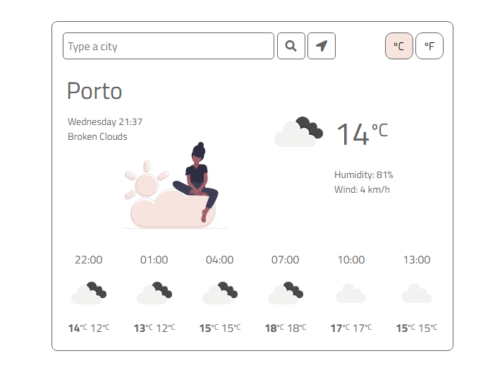

# WEATHER DASHBOARD

# Table of Contents
1. [Description](#description)
2. [Technology](#technology)
3. [Links](#links)
4. [Images/Assets](#imagesassets)

# Description
A weather app using openweathermap.org api

# Technology
* JavaScript
* BootStrap CSS (https://getbootstrap.com/)
* HTML
* CSS
* https://openweathermap.org/api
* Google Fonts
* Font Awesome

# Links
* Github: https://github.com/alu1868
* Repo: https://github.com/alu1868/Weather-App
* Live: https://alu1868.github.io/Weather-App/

# Images/Assets

