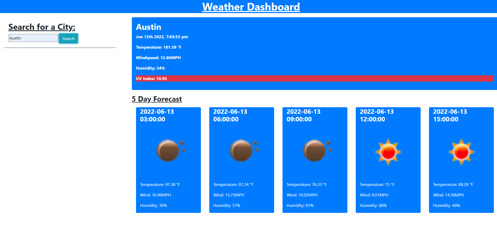

# WEATHER DASHBOARD

# Table of Contents
1. [User Story](#user-story)
2. [Acceptance Criteria](#acceptance-criteria)
3. [Description](#description)
4. [Technology](#technology)
5. [Links](#links)
6. [Images/Assets](#imagesassets)

# Description
    A simple Weather dashboard where you can search a city and you are presented with its weather conditions for the next few days

# Technology
* JavaScript
* BootStrap CSS (https://getbootstrap.com/)
* HTML
* CSS
* https://openweathermap.org/api

# Links
* Github: https://github.com/alu1868
* Repo: https://github.com/alu1868/Challenge-6-Weather-Dashboard

# Images/Assets

